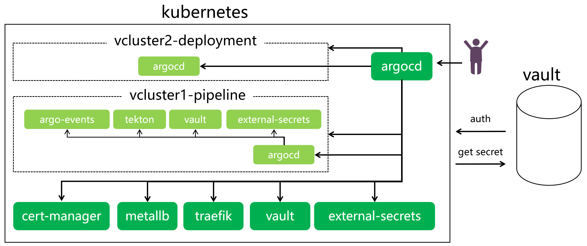

## 目标
1. 基于开源工具搭建CI环境； 
2. 基于CI环境实现一个代码提交即构建的流水线。 


## 工具及其关系概览

- metallb: k8s的lb工具。
- traefik: 反向代理工具，用于ingress的实现。
- cert-manager: 证书签发工具。
- vault: 密钥管理工具。
- external-secrets: 可以将外部的密钥同步为k8s的secret。
- vcluster: 可以在物理k8s集群中创建虚拟集群的工具。
- argo-events: 提供事件监听、转换和触发的工具。
- tekton: k8s原生的流水线工具。

## 前提

1. 搭建一个空的kubernetes集群； 
2. 搭建一个vault服务端实例； 
3. 在宿主机安装argoCD命令行； 
> 注意：以上服务有多种安装方式，下文任取一种作为示意。
4. 其他：fork github的DEMO代码。
> https://github.com/lanbingcloud/demo-pipeline-argoevents-tekton  
> 
> https://github.com/lanbingcloud/demo-user-project  
> 
> https://github.com/lanbingcloud/demo-user-deployments
   


### 搭建一个空的k8s集群
搭建一个空的kubernetes集群。此处以K3s作为示例。
```Shell
# 注意替换tls-san的IP
curl -sfL https://get.k3s.io | INSTALL_K3S_VERSION=v1.21.14+k3s1 sh -s - server --disable servicelb --disable traefik --disable metrics-server --tls-san 119.8.99.179
# 需提前创建.kube目录
cp /etc/rancher/k3s/k3s.yaml ~/.kube/k3s-config
cp /etc/rancher/k3s/k3s.yaml ~/.kube/config
export KUBECONFIG=~/.kube/config
```
### 搭建一个vault实例
搭建一个vault实例。vault有多种安装方式，包括根据安装包、helm、源码和docker安装。此处以安装包安装作为示例。

- 下载vault并配置; 
  从官网下载vault二进制文件安装包，注意选择与操作系统匹配的版本（此处以AMD64为例），下载完成后解压缩到目标目录；将目标目录添拷贝到PATH，或者拷贝vault文件到已有的PATH某目录下；
   ```
   # 查询版本，表示安装成功
   vault -version
   ```
- 准备配置文件，启动vault服务;
   ```Shell
   # 配置vault服务的配置文件，此处以config.hcl作为示例
   cat config.hcl
   storage "raft" {     #  配置vault的后端存储
      path    = "/opt/vault/data"
      node_id = "node1"
   }
   #  vault监听api请求的方式; 由于本DEMO需要通过本地访问vault服务，请确保vault服务的端口已提前开通
   listener "tcp" {     
      address     = "0.0.0.0:31820"
      tls_disable = "true"
   }
   disable_mlock = true
   #  通常被设置为listener地址的完整路径
   api_addr = "http://0.0.0.0:31820"   
   cluster_addr = "https://192.168.0.243:31821"
   ui = true
   ```
   
   ```
   # 启动服务
   vault server -config=config.hcl
   #  检查vault服务端状态，下文IP为vault服务所在服务器的内网IP，观察其Sealed的value为true；
   export VAULT_ADDR='http://192.168.0.243:31820'
   vault status
   # 第一次安装vault时，需要初始化valut; 初始化成功后保存好Initial Root Token和Unseal Key； 
   vault operator init
   # 通过Unseal Key让vault变更为Unseal状态，直到Sealed的value=false（此处示例要求至少3个unseal key才能解封vault）;
   vault operator unseal
   ```
- 验证vault服务状态
   ```
   # 通过界面访问vault（此处示例为http://119.8.99.179:31820）或者通过命令行登录vault服务(此处示例为内网IP);
   export VAULT_ADDR='http://192.168.0.243:31820'
   vault login
   # 当vault相关调试过程混乱，停止vault server重新配置
   pkill -9 vault
   ```


### 安装argocd命令行
查看argoCD对应版本，下载配套的二进制文件安装包（下载链接参见附件），下载完成后拷贝文件到已有的PATH目录（例如/usr/local/bin）。 
```
# 执行argocd version命令，查看版本验证是否安装成功
argocd version
```


## 实施步骤

总体上包括四部分，包括：
1. **维护密钥**：在vault服务端维护本次DEMO涉及的所有密钥，该步骤只包含存储密钥，并为其设置policy；至于授权方法得等到配套信息在后续步骤完全生成后才能完成；
2. **安装argoCD**：在宿主集群（k8s空集群）上手工安装argocd，供后续基于该argocd自动安装一系列工具； 
3. **安装argoCD app**:根据宿主集群上已安装的argocd，手工创建根project、app，使得argocd通过app of apps的方式自动安装宿主集群上的资源、运行时集群以及运行时集群上的资源; 
4. **验证流水线自动执行**：在用户侧代码库（此处指demo-user-project）提交代码，观察tekton控制面板是否自动执行流水线。


### 1.维护密钥
### 维护cert-manager相关密钥
用于存放cert-manager所需的证书和私钥的secret（此处以现成的证书文件作为示例）。通过vault界面配置vault的secrets、policy，后续再配置auth-kubernetes。
- 创建secrets：启用kv secrets，path为pki，并设置secret path为root、secret data分别为tls.crt和tls.key，为其配置预先准备的证书文件; 
- 创建policy：为确保可读性，将policy名称设置为secrets路径同名，其中“/”用“-”替代（pki-root）； policy表示具备指定路径下secrets的只读权限。
   ```
   path "pki/data/root" {
      capabilities = ["read"]
   }
   ```

#### 维护argo-events相关密钥
用于argoevents在github上创建webhook的secret。包括两个secrets：
- argoevents访问github api来生成webhook，即github accesstoken。操作路径为github代码库demo-user-project的上下文，顶部账号的Settings - Developer settings - Personal access token - Token(classic)，新增classic类型的token，填写描述、选择授权范围（授予repo和project的权限）后提交即可。注意保存该token信息，后续将不可以再查看； 
- 为了防止webhook被非法调用，创建github secret，用于确保触发webhook的是合法请求。操作路径为github代码库demo-user-project的上下文，Settings-security-Secrets-Actions，新增repository secrets，secrets可以是随机字符串，例如uuid。

通过vault界面配置vault的secrets、policy，后续配置auth-kubernetes;
- 创建secrets：启用kv secrets，path为git，并设置secret path为github/user-project/argoevents/webhook-access、secret data分别为secret、token，为其配置预先准备的github secret和github accesstoken;
- 创建policy：创建与secrets路径同名的policy，其中“/”用“-”替代（git-github-user-project-argoevents-webhook-access）。
  ```
  path "git/data/github/user-project/argoevents/webhook-access" {
     capabilities = ["read"]
  }
  ```


#### 维护pipelines推送镜像相关密钥
执行流水线涉及两个secrets。包括：向github仓库推送镜像需要的授权信息、以及从deployment代码库（此处指user-deployments）拉取代码并更新应用部署资源文件所需要的ssh私钥。此处先配置推送镜像的secret。
- 确定用于向github仓库推送镜像的账号密码，格式为：<account_name>:<personal_access_tokens>，例如：zhangsan:ghp_xxxxxxxxxxxxxxxx，并通过base64加密后作为secrets备用；注意该access token需要有github package的写入权限； 

通过vault界面配置vault的secrets、policy（此处为了方便，使用与argoevents生成webhook相同的access token），后续再配置auth-kubernetes；
 - 创建secrets：启用kv secrets，path为repo；并设置secret path为github/container/lanbing/default/readwrite，secret key为auth，配置预先准备的加密后的账号信息;
 - 创建policy：创建与secrets路径同名的policy，其中“/”用“-”替代（repo-github-container-lanbing-default-readwrite）。
   ```  
   path "repo/data/github/container/lanbing/default/readwrite" {
      capabilities = ["read"]
   }
   ```
#### 维护pipelines提交部署配置相关密钥
用于流水线修改应用部署配置的secret。
- 获取需要向github deployment代码库（此处指user-deployments）推送代码涉及的密钥；
  ```Shell 
  # 使用git客户端（例如git bash）生成密钥，注意替换为github账号的邮箱； 
  ssh-keygen -t ed25519 -C "your_email@example.com"
  # 查看生成的ssh密钥，默认名称分别为id_ed25519、id_ed25519.pub
  ls -al ~/.ssh
  # 将ssh私钥添加到ssh代理，不同操作系统的命令可能不同
  eval "$(ssh-agent -s)"
  ssh-add ~/.ssh/id_ed25519
  # 查询ssh私钥，供后续步骤使用
  cat ~/.ssh/id_ed25519
  # 查询ssh公钥，供后续步骤使用
  cat ~/.ssh/id_ed25519.pub
  ```
- 将ssh公钥添加为deployment代码库（此处指user-deployments）的deploy key，或者为github 账号添加ssh key； 并具备代码库的写入权限；

通过vault界面配置vault的secrets、policy，后续再配置auth-kubernetes。
- 创建secrets：启用kv secrets，path为git；并设置secret path为github/user-deployments/default/readwrite，secret key为deploykey，配置预先准备的ssh私钥。注意配置私钥时需要在界面预留一行空格，否则vault不能正确识别该secret，属于vault自身的缺陷； 
- 创建policy：创建与secrets路径同名的policy，其中“/”用“-”替代（git-github-user-deployments-default-readwrite）。
   ```  
   path "git/data/github/user-deployments/default/readwrite" {
      capabilities = ["read"]
   }
   ```

### 2.安装argoCD
在k8s空集群上手工安装argocd，供后续基于该argocd自动安装一系列工具。
```Shell  
# 切换到k8s空集群的上下文，fork一份demo代码到宿主机的某目录; 
export KUBECONFIG=~/.kube/config
# cd到fork代码目录（相对路径为cmds），执行argocd安装脚本install-argocd.sh; 
sh install-argocd.sh
# 为argocd添加补丁，执行patch-argocd-server.sh，后续等待trafik、ingress安装完毕可通过浏览器访问argocd； 
sh patch-argocd-server.sh
```

### 3.安装argoCD app
根据k8s空集群上已安装的argocd，手工创建根project、app，使得argocd通过app of apps的方式自动安装运行在k8s空集群上的资源、运行时集群以及运行时集群上的资源。

#### 修改代码相关配置
需要变更的代码主要包括argocd app监听的源代码库地址（需变更为fork出来的代码库）、宿主集群（k8s空集群）的地址、运行时集群的地址，以及地址变更影响的配套资源，详情参见“附件-代码库变更配置”。
- 根据脚本模板sed-demo.sh，按需替换，详见下文代码注释。
```shell
# 查看替换代码配置的脚本sed-demo.sh
cat sed-demo.sh
# 代码库：demo-pipeline-argoevents-tekton
# 批量替换argocd监听代码库为fork下来的代码库地址； 
sed -i -e "s#https://github.com/lanbingcloud/demo-pipeline-argoevents-tekton.git#https://github.com/lanbingcloud/demo-pipeline-argoevents-tekton-1.git#g"  `grep https://github.com/lanbingcloud/demo-pipeline-argoevents-tekton.git -rl demo-pipeline-argoevents-tekton-1`
# 批量替换宿主集群IP地址； 
sed -i -e "s#192.168.0.184#192.168.0.243#g"  `grep 192.168.0.184 -rl demo-pipeline-argoevents-tekton-1`
# 批量替换ingress等nip的地址：
sed -i -e "s#119-8-58-20#119-8-99-179#g"  `grep 119-8-58-20 -rl demo-pipeline-argoevents-tekton-1`
# 替换argo-events的eventsource的repo信息，将<zhangsan>替换为对应的owner；本示例与demo使用相同的owner，因此省略该步骤 
# sed -i -e "s#lanbingcloud#zhangsan#g"  demo-pipeline-argoevents-tekton-1/argo-events/overlays/production/eventsource.yaml
sed -i -e "s#demo-user-project#demo-user-project-1#g"  demo-pipeline-argoevents-tekton-1/argo-events/overlays/production/eventsource.yaml
#  替换init-pipeline.yaml的git-clone task的代码库地址：
sed -i -e "s#https://github.com/lanbingcloud/demo-user-project.git#https://github.com/lanbingcloud/demo-user-project-1.git#g" demo-pipeline-argoevents-tekton-1/argo-events/overlays/production/init-pipeline.yaml

# 代码库：demo-user-project
# 替换流水线task拉取代码、推送代码、推送镜像的地址； 
sed -i -e "s#https://github.com/lanbingcloud/demo-user-project.git#https://github.com/lanbingcloud/demo-user-project-1.git#g" demo-user-project-1/pipelines/test-pipeline.yaml
sed -i -e "s#git@github.com:lanbingcloud/demo-user-deployments.git#git@github.com:lanbingcloud/demo-user-deployments-1.git#g" demo-user-project-1/pipelines/test-pipeline.yaml
# 替换推送镜像的github package；本示例与demo使用相同的package，因此省略该步骤
# sed -i -e "s#ghcr.io/lanbingcloud#ghcr.io/zhangsan#g" demo-user-project-1/pipelines/test-pipeline.yaml

# 代码库：demo-user-deployments
# 替换业务应用svc的外部访问地址
sed -i -e "s#119-8-58-20#119-8-99-179#g"  demo-user-deployments-1/deployments/test/devops-sample-svc.yamlroot@ecs-bd3f:/opt/git/lanbingcloud# 
```

> 说明：
> - 上文脚本模板引用的fork代码库地址分别为：  
> https://github.com/lanbingcloud/demo-pipeline-argoevents-tekton-1.git  
> https://github.com/lanbingcloud/demo-user-project-1.git  
> https://github.com/lanbingcloud/demo-user-deployments-1.git
> - 安装k8s空集群的服务器内网IP：192.168.0.184，外网IP：119.8.99.179。

- 执行sed-demo.sh脚本，批量更新demo代码库的相关配置。
```shell
# 客户端克隆fork的代码库，保持sed-demo.sh与三个demo目录处于相同层级，执行脚本替换代码
sh sed-demo.sh
```

#### 手工安装根project和根app
通过命令手工安装根project和根app。
``` 
# cd到demo代码库根目录，手工安装根project
kubectl -nargocd apply -f project.yaml
# 手工安装根app，等待初始化结束；
kubectl -nargocd apply -f app.yaml
# 查看argocd app的安装进度和状态，安装过程需要等待一段时间
kubectl -nargocd get apps --watch
```
通过界面访问安装在k8s空集群上的argoCD（此处示例的argoCD访问地址为https://argocd.119-8-99-179.nip.io:30443），并执行脚本cmds/get-argocd-admin-pwd.sh，可获取argoCD的初始密码；初始化结束后观察app状态，两个app未完成同步，其他app处于已同步状态。
- cert-manager：vault服务端未设置了宿主集群（原k8s空集群）的auth授权，导致cert-manager app同步异常； 
- root：新生成的vcluster集群没有注册到宿主集群的argoCD，导致runtime-appset、runtime-argocd-appset同步异常。
<!--  -->

#### 修复cert-manager app - 配置vault授权

对于cert-manager app，通过vault界面配置宿主集群（原k8s空集群）与vault服务端的auth授权。
- 准备auth方法需要的信息，包括：kubernetes集群的CA证书、授权sa的token、集群host地址；切换到原k8s空集群的上下文，执行cmds目录下的脚本get-cluster-ca.sh获取CA证书内容、执行get-vault-auth-token.sh获取token、查看~/.kube/config文件明确host地址； 
- 启用auth方法，类型为kubernetes，path为host-cluster，并且需要将CA证书、token和host等上述信息上传或填写到vault的auth方法；
- 对于当前的auth方法，创建配套role，确保cert-manager app可以获取vault中相应的secrets。其中role名称为cert-manager，授权sa为default，授权ns为cert-manager, 授权policy为pki-root，将以上信息保存为auth方法的role;
- 回到argoCD访问界面，进入cert-manager app，删除名称为cert-manager-secretstore（类型=SecretStore）、root-issuer（类型=ExternalSecret）、org-issuer（类型=ClusterIssuer）的资源，强制其重新生成；再次观察cert-manager app状态为已同步。

#### 修复root app - 注册集群
对于root app，手工注册vcluster，使得root app的两个appset可以找到目标部署集群完成部署。
- 执行脚本cmds目录下的脚本get-vcluster-kubeconfig.sh获取vcluster的config文件，并保存到宿主机指定目录；并修改config文件的clusters[0].server=https:<内网IP>:<vcluster1-svc的nodeport>、contexts[0].name=<自定义名称>、  current-context=<自定义名称>; 
- 通过argocd命令添加vcluster；
   ``` 
   # 切换到宿主集群（原k8s空集群）的上下文，临时修改argocd server的svc类型为NodePort（过程略）; 
   # 使用命令行登录argocd，规则：argocd login <内网IP>:<argocd server svc的nodeport>； 
   # 执行cmds目录下的get-argocd-admin-pwd.sh脚本可以获取初始密码； 
   argocd login 192.168.0.243:30070
   # 切换到vcluster的上下文
   export KUBECONFIG=/opt/vcluster/kubeconfig-31543.yaml
   # 规则：argocd cluster add <cluster-name> --kubeconfig=<kubeconfig.yaml>
   argocd cluster add Default31543 --kubeconfig=/opt/vcluster/kubeconfig-31543.yaml
   # 查看argocd的集群信息，检查集群是否注册成功
   argocd cluster list
   ```
- 回到argoCD访问界面，进入root app，删除runtime-appset和runtime-argocd-appset，强制其重新生成，观察root app的同步状态更新为已同步。

#### 修复pipeline1 app - 配置vault授权
当root app状态显示为已同步，通过安装在vcluster上的argoCD访问界面，观察pipeline1 app的相关资源是否安装就绪。
- 查看argoCD的界面访问地址（此处示例为https://argocd.pipeline1.119-8-99-179.nip.io:30443），切换到vcluster集群的上下文，使用cmds目录下的get-argocd-admin-pwd.sh脚本可获取初始密码； 
- 观察安装在vcluster上的app状态，此时发现有user-namespaces、argo-events两个app并未处于同步状态。user-namespaces app的pvc一直是pending状态，由于pvc暂未被pods使用，这是正常现像；argo-events app的secretStore资源异常，vault服务端需要给vcluster集群授权；
- 通过vault界面配置vcluster集群的auth授权
  - 启用auth方法，类型为kubernetes，path为pipeline1-cluster; 并且需要将vcluster集群的CA证书、token和host等信息上传或填写到vault的auth方法。获取相关信息参见cert-manager app，不再赘述； 
  - 对于当前auth-kubernetes的方法，创建配套role，确保argo-events app可以获取vault中相应的secrets。 其中role=argo-events-sa，授权sa=argo-events-sa，授权ns=argo-events, 授权policy=git-github-user-project-argoevents-webhook-access; 将以上信息提交为上述auth方法的role;
- 通过argoCD界面删除argo-events app的资源，包括名称为webhook-secretstore（类型=SecretStore）、github-access（类型=ExternalSecret）、webhook（类型=EventSource）的资源，强制其重新生成；观察argoevents app状态为已同步。

### 4.验证流水线自动执行
用户侧代码库（此处指demo-user-project）提交代码之后，使用tekton dashboard观察流水线是否自动执行。 
本次示例的tekton dashboard地址为：http://tekton.pipeline1.119-8-99-179.nip.io:30080。

- 提交用户侧代码，观察流水线已经触发自动执行；
- 发现流水线执行时卡顿在git-clone-deployment task，检查vault服务端未配置授权。确认auth方法的path为pipeline1-cluster（前置步骤已配置），role为user-pipelines，sa为default，ns为user-pipelines，授权policy为git-github-user-deployments-default-readwrite，完整检查流水线的secrets涉及的policy还包括repo-github-container-lanbing-default-readwrite;
- 通过vault界面给path为pipeline1-cluster的auth方法配置role，使用上述信息配置；
- 再次提交用户侧代码，观察流水线执行成功。


## 问题
### 获取vault服务端密钥报403异常
1. vault服务端授权k8s，客户端访问服务端403异常。
   - 为vault server启用auth的sa，没有设置rbac.authorization.k8s.io的资源权限。注意检查sa配套的rbac。
2. 使用github私钥，拉取代码库时异常； 此时证书通过本地客户端验证正确、vault服务端auth-k8s授权验证正确。
   - 使用valut ui保存secrets时，增加一行空行；属于vault自身的缺陷。
   
### 删除argoCD app命名空间卡顿在terminating状态
argoCD app配置错误，更新配置后删除app，相关资源无法删除也无法正常安装、命名空间状态为terminating状态。
1. 通过命令行登录argocd，查询argoevent app的资源及其状态; 逐项手工删除处于未删除状态的资源； 
   ``` 
   argocd app get <app_name>
   argocd app delete-resource <app_name> --kind=<resouce_type> --resource-name=<resource_name> 
   ```
2. 检查卡顿状态的app的finalizers属性，删除其value（可通过argocd界面简化操作）。

### 向github推送代码异常
1. 使用https协议向github推送代码时，异常提示：OpenSSL SSL_connect: SSL_ERROR_SYSCALL in connection to github.com:443
   - 执行以下命令，可以短时间内缓解问题
      ``` 
      git config --global http.sslBackend "openssl"
      # 替换为对应文件，以下仅为示意
      git config --global http.sslCAInfo "C:\Program Files\Git\mingw64\ssl\cert.pem"
      ```
   - 替换为ssh协议后根除; 而且本地网络通过https访问github经常超时，建议替换为ssh协议。
1. 使用https协议执行push操作，输入账号密码后，提示:fatal: HttpRequestException encountered
   - github的账号密码认证方式不同于gitlab、以及早期版本；而是通过access token的方式替代账号密码进行认证； 
   - github操作路径：个人图标-settings-developer settings-personl access token，生成token，并按需授予repo的权限；再次Push时，替换密码输入即可。 

### argocd无法通过浏览器访问界面
1. argocd svc在反复操作过程，忘记执行patch-argocd-server.sh操作，导致svc没有增加traefik的注解。

### cert manager生成ClusterIssuer异常
cert manager生成 ClusterIssuer org-issuer异常，提示：Error getting keypair for CA issuer: certificate is not a CA。
1. 生成的secrets内容不符合CA证书。使用DEMO的相同证书，或者使用openssl重新生成证书，再写入vault。


## 附件

### 链接参考
**Github DEMO示例：**
https://github.com/lanbingcloud/demo-vcluster-tekton-argoevents-vaultagent-externalsecrets
https://github.com/lanbingcloud/demo-pipeline-argoevents-tekton

**B站讲解视频：**
https://www.bilibili.com/video/BV1yP4y1U7mS/?spm_id_from=333.999.0.0&vd_source=ddbfd6bc7b8ad554ea42861b279f978d
https://www.bilibili.com/video/BV1Fm4y1A7qL/?spm_id_from=333.999.0.0&vd_source=ddbfd6bc7b8ad554ea42861b279f978d

**vault相关：**
https://developer.hashicorp.com/vault/docs/install#installing-vault
https://developer.hashicorp.com/vault/docs/install#precompiled-binaries
https://support.hashicorp.com/hc/en-us/articles/4404389946387-Kubernetes-auth-method-Permission-Denied-error
https://developer.hashicorp.com/vault/docs

**argoCD命令行安装**
https://tanzu.vmware.com/developer/guides/argocd-gs/#install-and-set-up-the-argocd-cli

**github access token：**
https://docs.github.com/en/authentication/keeping-your-account-and-data-secure/creating-a-personal-access-token

**github ssh证书相关：**
https://docs.github.com/cn/authentication/connecting-to-github-with-ssh/generating-a-new-ssh-key-and-adding-it-to-the-ssh-agent
https://docs.github.com/cn/authentication/connecting-to-github-with-ssh/adding-a-new-ssh-key-to-your-github-account

**argoevent webhook：**
https://argoproj.github.io/argo-events/eventsources/webhook-authentication/

**推送image到github仓库：**
https://docs.github.com/en/actions/publishing-packages/publishing-docker-images

### **代码库变更配置**

#### 一. 代码库：demo-pipeline-argoevents-tekton
fork demo-pipeline-argoevents-tekton代码库，修改复制后的代码库。

##### 1.替换监听的代码库地址
相对路径：app.yaml
```yaml{7}
...
spec:
  project: demo-vcluster
  source:
    path: production
    # 替换为fork下来的代码库地址
    repoURL: https://github.com/lanbingcloud/demo-pipeline-argoevents-tekton-1.git
    targetRevision: HEAD
...
```

相对路径：production/runtime-appset.yaml
```yaml{8}
...
spec:
  ...
  template:
    spec:
      project: demo-vcluster
      source:
        repoURL: https://github.com/lanbingcloud/demo-pipeline-argoevents-tekton-1.git
        targetRevision: HEAD
        path: runtimes/{{runtime}}
...
```

| 代码库 | 文件相对路径 | 变更配置 | 配置说明 |
| ----- | ----- | ----- | ----- |
| demo-pipeline-argoevents-tekton | app.yaml | spec.source.repoURL | 变更为fork下来的代码库地址 |
| demo-pipeline-argoevents-tekton | production/vcluster-appset.yaml | spec.template.spec.source.repoURL | 变更为fork下来的代码库地址 |
| demo-pipeline-argoevents-tekton | vclusters/vcluster1/vcluster1-patch-app.yaml | spec.source.repoURL | 变更为fork下来的代码库地址 |
| demo-pipeline-argoevents-tekton | vclusters/vcluster1/vcluster1-app.yaml | spec.source.helm.values.extraArgs | 变更为宿主机的内网IP |
| demo-pipeline-argoevents-tekton | production/vault-app.yaml | spec.source.helm.values.externalVaultAddr | 变更为外置vault server的访问地址 |
| demo-pipeline-argoevents-tekton | production/patch-app.yaml | spec.source.repoURL | 变更为fork下来的代码库地址 |
| demo-pipeline-argoevents-tekton | production/metallb-app.yaml | spec.source.helm.values的address | 变更为宿主机的外部IP |
| demo-pipeline-argoevents-tekton | production/cert-manager-app.yaml | spec.source.repoURL | 变更为fork下来的代码库地址 |
| demo-pipeline-argoevents-tekton | cert-manager/overlays/production/secretstore.yaml | spec.provider.vault.server | 变更为外置vault server的访问地址 |
| demo-pipeline-argoevents-tekton | production/runtime-argocd-appset.yaml | spec.template.spec.source.repoURL | 变更为fork下来的代码库地址 |
| demo-pipeline-argoevents-tekton | production/runtime-argocd-appset.yaml | spec.generators.list[0].elements.clusterURL | 变更为IP地址为宿主机的内部IP |
| demo-pipeline-argoevents-tekton | production/runtime-appset.yaml | spec.template.spec.source.repoURL | 变更为fork下来的代码库地址 |
| demo-pipeline-argoevents-tekton | production/runtime-appset.yaml | spec.generators.list[0].elements.clusterURL | 变更为IP地址为宿主机的内部IP |
| demo-pipeline-argoevents-tekton | runtimes/pipeline1-runtime/pipeline1-app.yaml | spec.source.repoURL | 变更为fork下来的代码库地址 |
| demo-pipeline-argoevents-tekton | runtimes/pipeline1-runtime/production/vault-app.yaml | spec.source.helm.values的externalVaultAddr | 变更为外置vault server的访问地址 |
| demo-pipeline-argoevents-tekton | runtimes/pipeline1-runtime/production/user-namespaces-app.yaml | spec.source.repoURL | 变更为fork下来的代码库地址 |
| demo-pipeline-argoevents-tekton | runtimes/pipeline1-runtime/production/tekton-app.yaml | spec.source.repoURL | 变更为fork下来的代码库地址 |
| demo-pipeline-argoevents-tekton | tekton/overlays/production/dashboard-ingress.yaml | spec.rules.host[0] | 变更为含宿主机外部IP的host地址 |
| demo-pipeline-argoevents-tekton | runtimes/pipeline1-runtime/production/patch-app.yaml | spec.source.repoURL | 变更为fork下来的代码库地址 |
| demo-pipeline-argoevents-tekton | runtimes/pipeline1-runtime/production/patch/ingress-argocd.yaml | spec.rules.host[0]  | 变更为含宿主机外部IP的host地址 |
| demo-pipeline-argoevents-tekton | runtimes/pipeline1-runtime/production/argo-events-app.yaml | spec.source.repoURL  | 变更为fork下来的代码库地址 |
| demo-pipeline-argoevents-tekton | argo-events/overlays/production/eventsource.yaml | spec.github.user-project.repositories  | 变更为fork下来的代码库owner和名称 |
| demo-pipeline-argoevents-tekton | argo-events/overlays/production/eventsource.yaml | spec.github.user-project.webhook.url  | 变更为含宿主机外部IP的访问地址 |
| demo-pipeline-argoevents-tekton | argo-events/overlays/production/ingress-webhook-eventsource.yaml | spec.rules.host[0]  | 变更为含宿主机外部IP的访问地址 |
| demo-pipeline-argoevents-tekton | argo-events/overlays/production/secretstore.yaml | spec.provider.vault.server  | 变更为外置vault server的访问地址 |
| demo-pipeline-argoevents-tekton | argo-events/overlays/production/init-pipeline.yaml | spec.triggers.template[0].k8s.source.resource.spec.pipelineSpec.task.name[0].params.name[0].value  | 变更为fork下来的含代码和流水线的代码库（demo-user-project） |
| demo-user-project | pipelines/test-pipeline.yaml | spec.pipelineSpec.tasks[0].params[0].value  | 变更为fork下来的含代码和流水线的代码库（demo-user-project） |
| demo-user-project | pipelines/test-pipeline.yaml | spec.pipelineSpec.tasks[1].params[0].value  | 变更为fork下来的含部署清单的代码库（demo-user-deployments） |
| demo-user-project | pipelines/test-pipeline.yaml | spec.pipelineSpec.tasks[3].params[0].value  | 变更为fork下来的代码库对应的package库 |
| demo-user-project | pipelines/test-pipeline.yaml | spec.pipelineSpec.tasks[4].params[0].value  | 变更sed命令处理的镜像路径字符串 |
| demo-user-deployments | deployments/test/devops-sample-svc.yaml | (ingress)spec.rules.host[0]  | 变更为宿主集群ip的host地址 |

## 未完成（2022.11.12，正式提交后删除该章节）
一 内容
1. 网络相关：traefik、ingress、metallab
2. 证书相关：cert-manager
3. github：
1）https协议，客户端的认证的异常（OPENSSL 443）
2）github secrets
3）access token：fine-grained token；