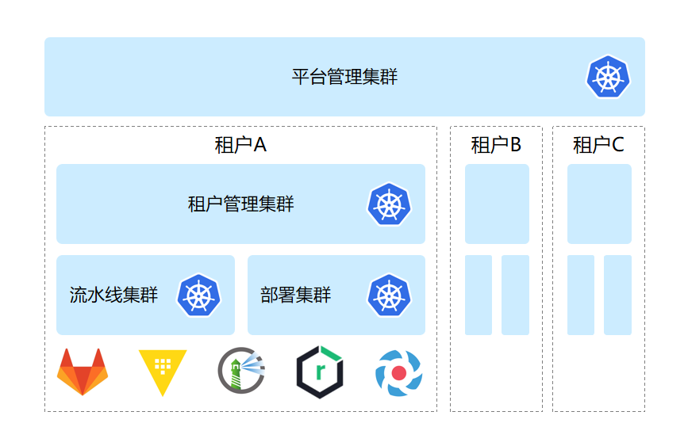

# 概述

Nautes 是Kubernetes原生的开源一站式开发者平台，融合了 DevOps 和 GitOps 理念和最佳实践，以可插拔的方式集成了业界最优秀的云原生开源项目。

具有以下特性：

- 遵循 GitOps 最佳实践，以版本库作为唯一可信数据源。当版本库中的数据有变更时，平台的 Operator 会自动识别变更并向 Kubernetes 集群做增量更新。
- 开箱即用，覆盖 DevOps 全流程的一站式开发者平台。
- 全分布式的多租户架构，支持租户和资源的水平扩展。
- 良好的适配性，除了底座 Kubernetes 以及 Git 外，其他组件均可被替换。
- 所有功能均提供声明式的REST API，支持二次开发。
- 对所集成的所有开源项目，均保持其原生特性，无裁剪式封装，对受管应用不产生二次绑定。
- 通过构建上层数据模型，实现对所集成的开源项目的统一认证、统一授权。
- 支持私有云、混合云的部署模式。

简要架构：

Nautes 采用全分布式的多租户架构，平台管理集群负责租户的分配和回收，每个租户独占一套资源（包括代码库、密钥库、制品库、认证服务器、集群等），租户内的资源由租户管理集群进行管理。

租户作为资源的管理单元，可由用户根据自身组织特性进行划分，常见的划分方式有：按产品团队、按部门、按子公司等。

租户内的资源也支持多实例部署，例如：可以在一个租户内部署多个 Harbor 实例，用于隔离不同产品的容器镜像数据。