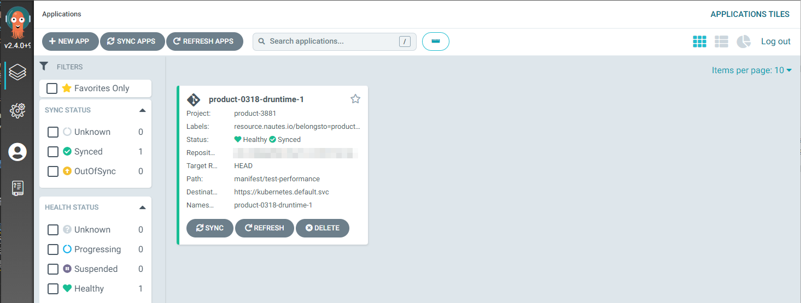

## 从零搭建部署运行时环境

下文将描述从零开始安装集群到自动执行部署的执行过程。包括以下步骤：
[准备前置条件](#准备前置条件)
[安装租户管理集群](#安装租户管理集群)
[注册部署集群](#注册部署集群)
[提交产品配置清单](#提交产品配置清单)
[提交部署配置清单](#提交部署配置清单)
[跟踪部署过程和结果](#跟踪部署过程和结果)

### 准备前置条件
在开始本节之前，请确保您已阅读“用户指南的概述”章节。
待补充。


### 安装租户管理集群

待补充。

### 注册部署集群

待补充。

### 提交产品配置清单
通过 Nautes CLI 自动提交产品、环境、项目、部署运行时等资源文件，这些资源文件组成了“产品配置清单”。提交成功后，Nautes 将监听产品配置清单向部署集群实施自动部署，以安装产品的部署运行时环境。

1. clone 存储产品配置库模板的代码库，批量替换资源的参数值。产品配置库模板的内容如下：
```yaml
# 产品
# 批量替换 spec.name、spec.git.gitlab.name、spec.git.gitlab.path、spec.git.gitlab.description等参数值；
apiVersion: nautes.resource.nautes.io/v1alpha10329
kind: Product
spec:
  name: demo-0329
  git:
    gitlab:
      # 产品名称
      name: demo-0329
      # 产品路径
      path: demo-0329
      visibility: private
      description: demo-0329
      parentID: 0
---
# 环境
# 批量替换 spec.name、spec.product等参数值；这里假设环境关联的 kubernetes 集群名称为 test-deployment-runtime； 
apiVersion: nautes.resource.nautes.io/v1alpha1
kind: Environment
spec:
  # 环镜名称
  name: env-demo-0329
  # 环境所属的产品
  product: demo-0329
  # 环境关联的集群
  cluster: test-deployment-runtime
  envType: dev
---
# 项目
# 批量替换 spec.name、spec.product等参数值
apiVersion: "nautes.resource.nautes.io/v1alpha1"
kind: Project
spec:
  # 项目名称
  name: project-demo-0329
  # 项目所属的产品
  product: demo-0329
  language: golang
---
# 代码库，后续用于存储产品的部署配置清单
# 批量替换 spec.name、spec.product、spec.project、spec.git.gitlab.name、spec.git.gitlab.path、spec.git.gitlab.description
apiVersion: nautes.resource.nautes.io/v1alpha1
kind: CodeRepo
spec:
  # 代码库名称
  name: coderepo-demo-0329
  deploymentRuntime: true
  pipelineRuntime: false
  # 代码库所属的产品
  product: demo-0329
  # 代码库所属的项目
  project: project-demo-0329
  webhook:
    events: ["push_events"]
    isolation: shared
  git:
    gitlab:
      # 代码库名称
      name: coderepo-demo-0329
      # 代码库路径
      path: coderepo-demo-0329 
      visibility: private
      description: coderepo-demo-0329 
---
# 部署运行时
# 批量替换 spec.name、spec.destination、spec.manifestsource.codeRepo、spec.product、spec.projectsRef； 
apiVersion: nautes.resource.nautes.io/v1alpha1
kind: DeploymentRuntime
spec:
  # 部署运行时名称
  name: dr-demo-0329
  # 部署运行时的目标集群，这里指部署集群
  destination: env-demo-0329
  manifestsource:
    # 部署运行时监听的代码库
    codeRepo: coderepo-demo-0329
    # 部署运行时监听的代码库相对路径
    path: deployments
    # 部署运行时监听的代码库版本或分支
    targetRevision: main
  product: demo-0329
  projectsRef:
    - project-demo-0329
```
2. 在 Windows 操作系统下，将 [nautes.exe]() 文件存放于某个目录，执行下文的 cmd 命令。执行成功后，Nautes 将生成产品配置清单，并自动安装产品的部署运行时环境。
```cmd
REM apply 后面的三个参数分别表示：产品配置库模板在模板代码库中的相对路径； GitLab 用户账号对应的 access token； Nautes API 的访问地址； 
nautes apply -f examples/demo.yaml -t access-token -s http://10.204.118.221:32159/
```

### 提交部署配置清单

通过 Git CLI 提交产品的部署配置清单，例如 deployment、service、volume 等资源。提交成功后，Nautes 将部署配置清单自动同步到产品的部署运行时环境，并执行自动部署。详细步骤参见 [GitLab](https://docs.gitlab.com/ee/tutorials/make_your_first_git_commit.html)。

### 跟踪部署过程和结果
在部署产品的过程中或部署完成后，可以通过 ArgoCD 控制台或者 kubectl 命令行来跟踪部署过程和结果。这两种方式均支持单点登录，方便用户管理被授权的产品资源。
1. 访问安装在部署集群的 ArgoCD Web UI 地址【地址从哪来】，点击 log in via dex，填写 GitLab 账号和密码，然后单点登入 ArgoCD，并通过 ArgoCD 的 Web UI 管理被授权产品的 application，详细操作步骤参见 [ArgoCD](https://argo-cd.readthedocs.io/en/stable/getting_started/) 。




2. 访问 dex 服务地址，填写 extra scopes 值为 groups，点击 login，保存 ID Token 到本地。通过脚本获取部署集群的 kubeconfig 文件，并将 ID Token 替换 kubeconfig 文件中的 users 配置，然后便可以通过 kubectl 命令行管理被授权的产品资源。


```Shell
# 使用命令获取部署集群的 kubeconfig 文件
kubectl get secret vc-$VCLUSTER-vcluster -n $VCLUSTER --template={{.data.config}} | base64 -d
#以集群名称 test-deployment-runtime 替换变量 $VCLUSTER 为例
kubectl get secret vc-test-deployment-runtime-vcluster -n test-deployment-runtime --template={{.data.config}} | base64 -d
```
```yaml
# 将 ID-Token 替换 kubeconfig 文件中的 users 配置
apiVersion: v1
clusters:
- cluster:
    certificate-authority-data: LS0tLS1CRUdJTiBDRVJUSUZJQ0FURS0tLS0tCk1JSUJkekNDQVIyZ0F3SUJBZ0lCQURBS0JnZ3Foa2pPUFFRREFqQWpNU0V3SHdZRFZRUUREQmhyTTNNdGMyVnkKZG1WeUxXTmhRREUyTnprd05UUTNNamt3SGhjTk1qTXdNekUzTVRJd05USTVXaGNOTXpNd016RTBNVEl3TlRJNQpXakFqTVNFd0h3WURWUVFEREJock0zTXRjMlZ5ZG1WeUxXTmhRREUyTnprd05UUTNNamt3V1RBVEJnY3Foa2pPClBRSUJCZ2dxaGtqT1BRTUJCd05DQUFRQlZEV2NVRmRLVHFJbEMzbktiYVU2Qmo0eTlZenRNbzNIMkN1ZlpteDMKaitMQUk0Rmh5R2p5UjhxeUhQb0FHcnhVVTVpOTgxc2lUbmVWV3pPYmFRMDRvMEl3UURBT0JnTlZIUThCQWY4RQpCQU1DQXFRd0R3WURWUjBUQVFIL0JBVXdBd0VCL3pBZEJnTlZIUTRFRmdRVVk4NjdIUm92ZWlzUFBhTmgzUzVoClBiNkg0cGN3Q2dZSUtvWkl6ajBFQXdJRFNBQXdSUUloQUlyMTFvZGlOcE52cTN0ZkxPWmRKNEMwMWVOZXR5TDgKUStFKzVxYjdUaTFOQWlCVmZiUFRaQmF0MjlpanRiOUpuUWZ6NnVoYkt6cVRrVUpraWZLbXpvK3p4dz09Ci0tLS0tRU5EIENFUlRJRklDQVRFLS0tLS0K
    # 根据实际情况修改 kubernetes 的 server 地址
    server: https://10.204.118.216:32056
  name: local
contexts:
- context:
    cluster: local
    namespace: default
    user: user
  name: Default
current-context: Default
kind: Config
preferences: {}
users:
- name: user
  user:
    token: eyJhbGciOiJSUzI1NiIsImtpZCI6ImQ4ZGU5MDdiYWNiNDE2NjE3MDk3MTc4ZDg4NzgxYTU4ZjdiN2NmY2EifQ.eyJpc3MiOiJodHRwczovL2RleC5ibHV6aW4uaW86OTA4MCIsInN1YiI6IkNnSXhNaElHWjJsMGJHRmkiLCJhdWQiOiJwbGF0Zm9ybSIsImV4cCI6MTY4MDU5NDIzMCwiaWF0IjoxNjgwNTA3ODMwLCJhdF9oYXNoIjoidHFJa1E0QlI4NHg5dkJvQzBIUTFLQSIsImNfaGFzaCI6InRjZkc3Z3RJUURaX1NnczNWS1dFbWciLCJlbWFpbCI6ImxpdWp1bmhvbmdAdmlzcHJhY3RpY2UuY29tIiwiZW1haWxfdmVyaWZpZWQiOnRydWUsImdyb3VwcyI6WyJ5dW50aSIsIm5hdXRlcy1sYWJzIiwidGVrdG9uY2QiLCJkZXYtdGVuYW50IiwidGVzdC1wcm9kdWN0LTAzMTgiLCJ0ZXN0LXByb2R1Y3QtMDMxOC1CIiwieXVudGkvc3ViZ3JvdXAiLCJ5dW50aS9zdWJncm91cC9zdWJzdWJncm91cCJdLCJuYW1lIjoibGl1anVuaG9uZyIsInByZWZlcnJlZF91c2VybmFtZSI6ImxpdWp1bmhvbmcifQ.B6Aph154ziVkQvUGsAFNYj8aCGHLFSHfIkb0GHW80ivFW57lRtPlQ2zj4o0gr6LHFcSgrPuA8tCMnZCI1XSRargJDyAVEyK4athUdOS3QLU5B-ukrn21Ne5uPQfEDsu8CA26j3I32ceTW5USGRpOXebUER0ZGNG7qRaqcholx-NhYo0XFea_szQct7NBJbIA3e-NwdL1oR7sRgqce2iJpl2lpeSrDhDJvbHGUtwavM25n1yKWGBPX21od5WIp2OSYGnMjD3KhDvl40mTxmx8foBJ49f11Y2oB4tgnB269Zk5PPymYDj-6c3XcbV5kYfIRwTjJkrcgmYvXBdOpHfDrQ
```

```Shell
# 切换集群为上文修改后的 kubeconfig 文件
export KUBECONFIG=/opt/vcluster/kubeconfig-dex.yaml
# 使用kubectl命令行管理被授权的资源，以下命令仅为示例
kubectl get deployment -n deployment-runtime-1
kubectl delete deployment deployment-test -n deployment-runtime-1
```