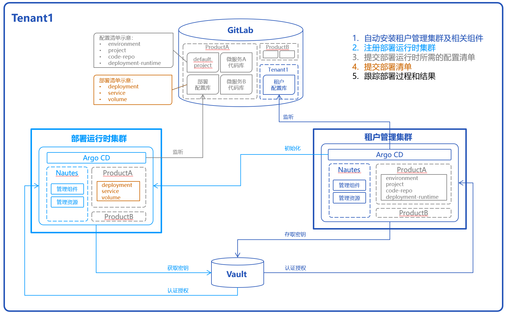

## Nautes 简介
Nautes是一个开源的CI/CD持续交付平台，融合了DevOps理念和GitOps实践。

具有以下特性：
- 统一账号认证和授权，只需登录一次即可在多个异构工具之间使用。
- 使用 Git 库作为单一配置库，确保环境配置的一致性和应用变更的可追溯性。
- 集成密钥管理工具（Vault），以保护、存储和管理敏感数据。
- 使用单一的 Git 配置库，自动化持续部署应用系统及其基础设施，提升部署可靠性。
- 可视化跟踪部署链路，以便快速发现和定位问题。

## 主要流程简介
下文将描述一个租户从零开始到自动实施部署的主流程。主流程执行成功之后的整体效果，如下图所示：

每个租户只有一个租户管理集群，该集群负责初始化当前租户的所有运行时集群，并向这些运行时集群安装组件及同步资源。此外，它还协调各种组件，以向运行时集群实施自动化部署。每个租户也只有一个租户配置库。租户管理集群通过监听租户配置库，向当前集群自动更新相关组件和资源。  
每个租户可以拥有多个运行时集群，这些运行时集群是承载IT系统运行时环境的真正载体，可以是虚拟集群或者物理集群。  

在Nautes中，对于微服务架构的IT系统，“产品”表示一个IT系统，“项目”表示一个微服务。因此，一个产品包含多个项目，每个项目有独立的代码库。  
提交部署运行时的配置清单后，产品分别与 Gitlab 中的 group 和 Kubernetes 集群中的 namespace 对应，Nautes 借助 group 和 namespace 的规则对产品进行权限隔离。  
每个产品可以包含多个部署运行时，例如，使用相同部署清单在不同集群所创建出来的功能测试和客户演示环境。同时，在相同集群上也可以承载多个产品的部署运行时环境。  

为了保护敏感信息不被泄露，在 Nautes 中的敏感信息均通过 Vault 存取。  

主体流程的步骤如下：
- [Nautes 简介](#nautes-简介)
- [主要流程简介](#主要流程简介)
  - [自动安装租户管理集群及相关组件](#自动安装租户管理集群及相关组件)
  - [注册部署运行时集群](#注册部署运行时集群)
  - [提交部署运行时所需的产品配置清单](#提交部署运行时所需的产品配置清单)
  - [提交部署清单](#提交部署清单)
  - [跟踪部署过程和结果](#跟踪部署过程和结果)

### 自动安装租户管理集群及相关组件

### 注册部署运行时集群

### 提交部署运行时所需的产品配置清单

“配置清单”指部署运行时环境所需的资源，包括：环境（负载IT系统部署运行时的被授权集群）、项目（IT系统的某个微服务）、代码库（存储部署配置清单的 GitLab 代码库，简称部署配置库）和部署运行时（IT系统的部署运行时配置）等资源。 
有两种方式可以提交配置清单：Nautes-CLI 和 API 接口。使用 Nautes-CLI 的详细步骤参见 [入门指南] 章节，使用 API 接口的详细步骤参见 [用户指南] 章节。  
无论使用哪种方式，提交配置清单都有先后顺序：  
   a. 正向新增的顺序：创建产品 -> 创建环境 ->  创建项目 -> 创建代码库 -> 创建部署运行时。  
   b. 反向销毁的顺序：删除部署运行时 -> 删除代码库 -> 删除项目 -> 删除环境 -> 删除产品。    
执行提交后，Nautes 将向 GitLab 中名称为 default.project 的代码库提交资源文件，这个代码库属于某个产品，用于存储产品的环境、项目、代码库、运行时等资源。一个产品有且只有一个 default.project 代码库。  
提交成功后，Nautes 将根据配置清单向目标集群自动安装相关资源，确保目标集群具备监听部署配置库、并向当前集群自动部署的能力。

### 提交部署清单 
通过 Git-CLI 向部署配置库提交部署配置清单，例如 deployment、sevice、volume 等资源，Nautes 将根据部署清单进行自动化部署。

### 跟踪部署过程和结果  
Nautes 部署过程中或者部署完成后，有两种方式可以跟踪部署过程和结果：ArgoCD 控制台和 kubectl。两种方式均支持单点登录，以便访问被授权产品的相关资源。详细步骤参见 [用户指南] 章节。  
   a. 访问 ArgoCD 控制台，管理被授权产品的 ArgoCD application。例如，通过可视化界面查看 ArgoCD application 的部署状态、事件、日志等，删除资源并重新同步资源。  
   b. 通过 kubectl 查看被授权产品的 namespace，并且管理该 namespace 中的资源。例如，使用 kubectl 命令查看 deployment、service 资源的事件、日志等，删除资源等待其重建。