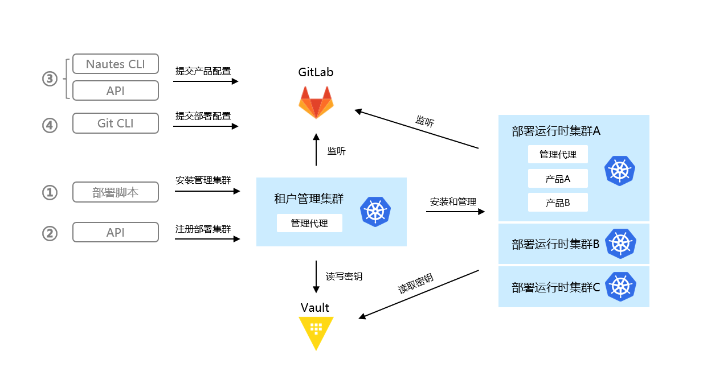

# 概述

Nautes是一个开源的CI/CD持续交付平台，融合了DevOps理念和GitOps实践。

具有以下特性：
- 统一账号认证和授权，只需登录一次即可在多个异构工具之间使用。
- 使用 Git 库作为单一配置库，确保环境配置的一致性和应用变更的可追溯性。
- 集成密钥管理工具（Vault），以保护、存储和管理敏感数据。
- 自动化持续部署应用系统及其基础设施，提升部署可靠性。
- 可视化跟踪部署链路，以便快速发现和定位问题。

## 流程简介
下文将描述安装部署运行时环境的主流程。包括以下步骤:
[安装部署](#安装部署)
[注册部署运行时集群](#注册部署运行时集群)
[提交产品配置清单](#提交产品配置清单)
[提交部署配置清单](#提交部署清单)
[查看部署结果](#查看部署结果)

主流程成功执行之后的效果，如下图所示：

在 Nautes 中，租户管理集群和部署运行时集群是必不可少的组成部分。每个租户只有一个租户管理集群，负责初始化该租户的所有部署运行时集群，并协调各种组件，以向部署运行时集群实施自动化部署。每个租户只有一个存储在 GitLab 中的租户配置库，租户管理集群通过监听租户配置库，向其自动更新相关组件和资源。  
每个租户可以拥有多个部署运行时集群，这些部署运行时集群是承载IT系统运行时环境的真正载体，可以是虚拟集群或者物理集群。  

根据IT系统的生命周期，不同阶段需要有配套的运行时环境，用于验证或使用IT系统的功能和非功能特性。通常根据生命周期的不同阶段划分为不同类型的环境，例如开发、测试、预生产和生产环境，这里的环境是一个逻辑概念，作为IT系统部署运行时的管理单元。  
环境需要在部署运行时集群上运行，因此必须将环境与部署运行时集群相关联，以便IT系统部署到正确的运行时环境中。  

在Nautes中，对于微服务架构的IT系统，“产品”表示一个IT系统，“项目”表示一个微服务。因此，一个产品包含多个项目，每个项目有独立的代码库。  
产品进行到一定阶段时需要验证或使用其特性，通常会根据部署配置向环境所关联的部署运行时集群进行部署，以生成部署运行时环境。每个产品可以包含多个部署运行时，例如，使用相同部署配置在不同集群所创建出来的功能测试和客户演示环境。同时，在相同集群上也可以承载多个产品的部署运行时环境。    

Nautes 通过 Kubernetes 资源文件来定义环境、项目、代码库和部署运行时，并将这些资源文件存储到产品对应的 GitLab 代码库，这些资源文件的集合称为“产品配置清单”。Nautes 监听产品配置清单向部署运行时集群实施自动部署，创建或更新产品的部署运行时环境。  

用户向部署运行时集群监听的 GitLab 代码库提交或更新部署配置文件，这些部署配置文件的集合称为“部署配置清单”。产品的部署运行时环境监听部署配置清单并向部署运行时集群实施自动部署，直到部署运行时集群中的实际状态与 GitLab 代码库中的预期状态一致为止。  

为了保护敏感信息不被泄露，Nautes 中的敏感信息均通过 Vault 存取。    

## 安装部署
详情参见 [安装部署](quickstart-03.md)。

## 注册部署运行时集群
【待补充】

## 提交产品配置清单
提交产品配置清单支持两种方式：Nautes CLI 和 API 接口。使用 Nautes CLI 的详细步骤参见 [提交产品配置清单](quickstart-01.md#提交产品配置清单) 章节，使用 API 接口的详细步骤参见“用户指南”的“维护产品、维护项目、维护代码库、维护环境、维护部署运行时” 章节。  
提交产品配置清单有先后顺序。正向新增的顺序是：创建产品、创建环境、创建项目、创建代码库、创建部署运行时。反向销毁的顺序是：删除部署运行时、删除代码库、删除项目、删除环境、删除产品。  

产品创建成功后，将在 GitLab 中创建与产品同名的 group，并在这个 group 中创建名称为 default.project 的代码库，用于存储该产品的配置清单，包括环境、项目、代码库和部署运行时的资源文件。一个产品有且只有一个 default.project 代码库。  

产品配置清单创建成功后，将根据产品配置清单在部署运行时集群中自动安装相关资源，使得部署运行时集群具备监听产品的 GitLab 代码库、并向该集群自动部署的能力。

## 提交部署清单 
使用 Git CLI 向产品的 GitLab 代码库提交部署配置清单，例如 deployment、service 等资源文件。提交成功后，将根据部署配置清单向指定的部署运行时集群部署产品。详情参考 [提交部署配置清单](quickstart-01.md#提交部署配置清单)。

## 查看部署结果  
部署过程中或者部署完成后，支持两种方式来查看部署结果：ArgoCD 控制台和 kubectl 命令行。这两种方式均支持单点登录，方便用户管理被授权的产品资源。详细参考 [查看部署结果](user-guide-06.md) 章节。