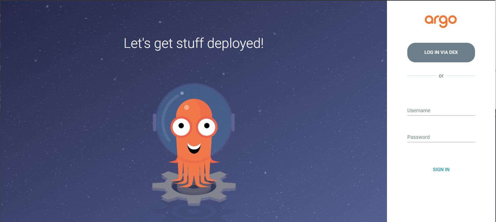
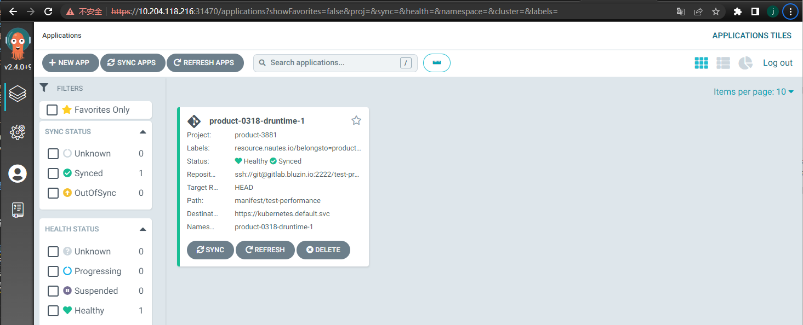
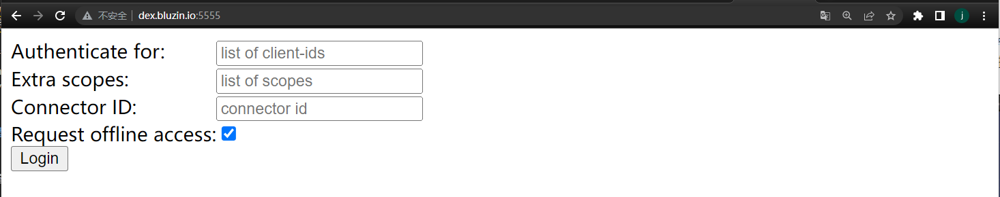

# 查看部署结果

在开始本节之前，请确保您已阅读 [概述](user-guide-00.md) 章节，了解创建运行时环境的主流程和相关术语；并且已经创建了至少一个部署运行时，详情参见 [维护部署运行时](user-guide-05.md)。

在部署产品的过程中或者部署完成后，支持通过 ArgoCD 控制台和 kubectl 命令行两种方式查看部署结果。产品分别与 ArgoCD 中的 project、Kubernetes 集群中的 namespace 建立对应关系，借助 ArgoCD project 和 Kubernetes namespace 既定规则对产品进行权限管理。

下面将详细介绍这两种方式的操作步骤。

## 查看 ArgoCD 的资源

查看产品的相关资源：
1. 访问安装在部署运行时集群中的 [ArgoCD UI](quickstart-03.md#查看组件信息) 。
2. 点击 log in via dex，将跳转到 GitLab UI 地址；填写您的 GitLab 账号密码并点击登录，将单点登入到 ArgoCD。在 ArgoCD UI，您可以查看被授权产品相关的 ArgoCD applications。ArgoCD applications 与产品的部署运行时对应。

 
3. 点击 ArgoCD UI 左侧菜单栏的“设置”，将跳转到 ArgoCD 的设置功能界面；点击 projects，可以查看授权产品相关的 ArgoCD projects。ArgoCD projects 与产品对应。
由于一个产品可以包含多个部署运行时，一个用户可以是多个产品的成员，因此通过 ArgoCD UI 可以查看授权产品的所有部署运行时环境。

查看产品的部署运行时环境：
1. 选择某个 ArgoCD application，将跳转到 application 的详情界面，并呈现部署运行时环境中的资源，例如 deployment、service 等。可以查看资源的类型、名称、运行状态、健康状态、运行时长、运行实例数等。
2. 选择某个资源，可以查看资源的资源清单、事件、日志等，并对该资源执行同步、重启、删除等操作。用户拥有 ArgoCD project 中所有 applications、exec、logs 资源的所有操作权限。由于 ArgoCD 监听了产品的代码库，因此无论在 ArgoCD 中怎么操作，最终都将与代码库中的部署配置清单保持一致。


## 查看 kubectl 的资源
1. 安装 Dex 客户端。【未完成】
   
2. 访问 Dex 客户端，填写 extra scopes 属性值为 groups，点击 login，保存 ID Token 到本地。


生成的 ID Token，类似下文：
```Shell
eyJhbGciOiJSUzI1NiIsImtpZCI6IjA2OGUyODFmN2FkYTk2NjNmMWI0MTc0NGFhYTUzZDRmYjk0N2Q1YjMifQ.eyJpc3MiOiJodHRwczovL2RleC5ibHV6aW4uaW86OTA4MCIsInN1YiI6IkNnSXhNaElHWjJsMGJHRmkiLCJhdWQiOiJwbGF0Zm9ybSIsImV4cCI6MTY4MDg3Mjc2MiwiaWF0IjoxNjgwNzg2MzYyLCJhdF9oYXNoIjoiWTNNbnRHLTE3SERaWjNVb0hiNWdmUSIsImNfaGFzaCI6IlBGUXNEM1hPSkhNZ1B3RW1LNXl5bEEiLCJlbWFpbCI6ImxpdWp1bmhvbmdAdmlzcHJhY3RpY2UuY29tIiwiZW1haWxfdmVyaWZpZWQiOnRydWUsImdyb3VwcyI6WyJ5dW50aSIsIm5hdXRlcy1sYWJzIiwidGVrdG9uY2QiLCJkZXYtdGVuYW50IiwieXVudGkvc3ViZ3JvdXAiLCJ5dW50aS9zdWJncm91cC9zdWJzdWJncm91cCJdLCJuYW1lIjoibGl1anVuaG9uZyIsInByZWZlcnJlZF91c2VybmFtZSI6ImxpdWp1bmhvbmcifQ.AYiLwJMcVaJdVdF-j_RZnHCPpg1psF3CJlzlBzvBYcuI_t7slgRaumRmGJEYXHYn2QFxjEZCNnBiOpJDDJoitVTxi1qoZ2nNoxhB3Wtxc1MoqkiPR5wy49yHw5roTnqIuEBy5BMpN_embxB9vK1bwxf414PsYKm1Dhbj8dynpURjpTsLrN5k7zVC7RQxVvglNX4cgYEucvSLqMEdtHNlmtnRsl6DJuItxC0MYwXlp4C9FNWswUjSpargdX4wgqfYy91l66GiI2Xj_zdba0NHLcPean-nmBMObLNhxex4hj8IVcGyiEu9in87y8eisrCBoLEWP9SJ_ZxWiOPoTFr54A
```

2. 通过命令行获取部署运行时集群的 kubeconfig 文件，并将 ID Token 替换 kubeconfig 文件中的 users 配置。
```Shell
# 将实际的集群名称替换 $VCLUSTER 变量，并执行命令行获取部署运行时集群的 kubeconfig 文件
kubectl get secret vc-$VCLUSTER-vcluster -n $VCLUSTER --template={{.data.config}} | base64 -d
```

```yaml
# 将 ID-Token 替换 kubeconfig 文件中的 users 配置
apiVersion: v1
clusters:
......
kind: Config
preferences: {}
users:
- name: user
  user:
    token: xxxxxxxxxxxxxxxxxxxxxxxxxxxxxxxxxxxxxxxxxxxxxxxxxxxxxxxxx
```

3. 在 kubectl 客户端，切换 KUBECONFIG 环境变量为前置步骤的 kubeconfig 文件之后，可以通过 kubectl 命令行查看与部署运行时对应的 namespace 中的资源，并且拥有该 namespace 的管理员权限。
```Shell
# 切换 Kubernetes 集群为上文修改后的 kubeconfig 文件
export KUBECONFIG=/opt/vcluster/kubeconfig-dex.yaml
# 使用 kubectl 命令行管理产品的相关资源，以下命令行仅为示例
kubectl get deployment -n deployment-runtime-1
kubectl delete deployment deployment-test -n deployment-runtime-1
```