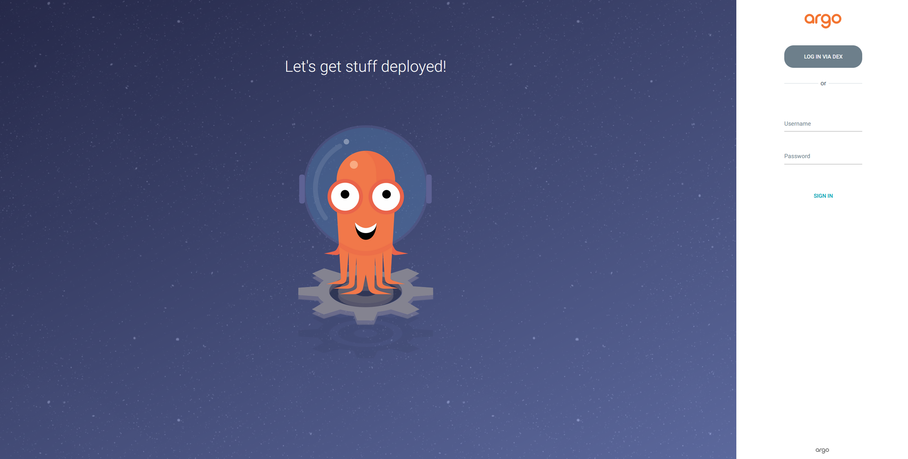
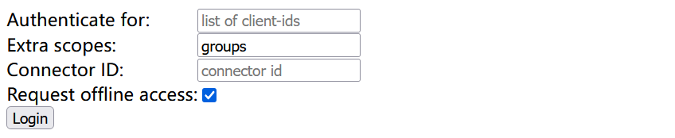

# 跟踪部署过程和结果

## 简介

在开始本节之前，请确保您已阅读 [用户指南的概述](user-guide-00.md) 章节，了解 Nautes 的主流程和相关术语；并且已经创建了至少一个部署运行时，详情参见 [维护部署运行时](user-guide-05.md)。

Nautes 在部署产品的过程中或者部署完成后，支持通过 ArgoCD 控制台和 kubectl 命令行两种方式跟踪部署过程和部署结果。Nautes 中的产品分别与 ArgoCD 中的 project、Kubernetes 集群中的 namespace 建立对应关系，借助 ArgoCD project 和 Kubernetes namespace 既定规则对产品进行权限管理。

下面将详细介绍这两种方式的操作步骤。

## ArgoCD 控制台
1. 访问安装在部署集群中 ArgoCD 的 Web UI 地址【补充访问地址】，点击 log in via dex，在弹出的 GitLab Web UI 中填写您的 GitLab 账号和密码，点击登录后将单点登入到 ArgoCD。 

2. 在 ArgoCD Web UI，您可以查看与授权产品对应的 ArgoCD project，并拥有这些 project 下 application、exec、logs 资源的所有操作权限。详情参考 [ArgoCD](https://argo-cd.readthedocs.io/en/stable/getting_started/) 。
 

## kubectl 命令行
1. 访问 dex 的服务地址【补充访问地址】，填写 extra scopes 属性值为 groups，点击 login，保存 ID Token 到本地。



2. 通过脚本获取部署集群的 kubeconfig 文件，并将 ID Token 替换 kubeconfig 文件中的 users 配置。
```Shell
# 将实际的集群名称替换 $VCLUSTER 变量，并执行命令行获取部署集群的 kubeconfig 文件
kubectl get secret vc-$VCLUSTER-vcluster -n $VCLUSTER --template={{.data.config}} | base64 -d
```

```yaml
# 将 ID-Token 替换 kubeconfig 文件中的 users 配置
apiVersion: v1
clusters:
......
kind: Config
preferences: {}
users:
- name: user
  user:
    token: xxxxxxxxxxxxxxxxxxxxxxxxxxxxxxxxxxxxxxxxxxxxxxxxxxxxxxxxx
```

3. 在 kubectl 客户端，切换 KUBECONFIG 环境变量为前置步骤的 kubeconfig 文件之后，可以通过 kubectl 命令行查看与授权产品对应的 namespace 中的资源，并且拥有该 namespace 的管理员权限。
```Shell
# 切换 Kubernetes 集群为上文修改后的 kubeconfig 文件
export KUBECONFIG=/opt/vcluster/kubeconfig-dex.yaml
# 使用 kubectl 命令行管理产品的相关资源，以下命令行仅为示例
kubectl get deployment -n deployment-runtime-1
kubectl delete deployment deployment-test -n deployment-runtime-1
```